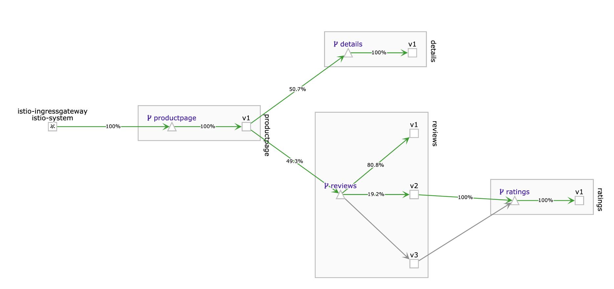
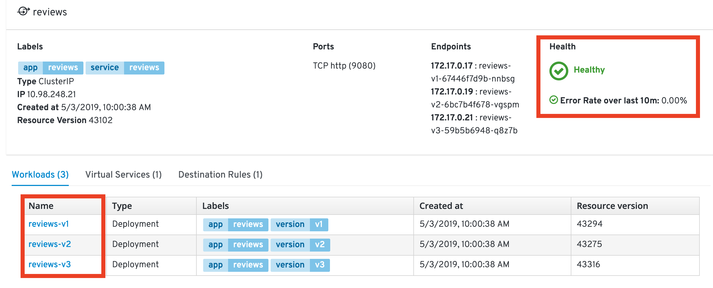
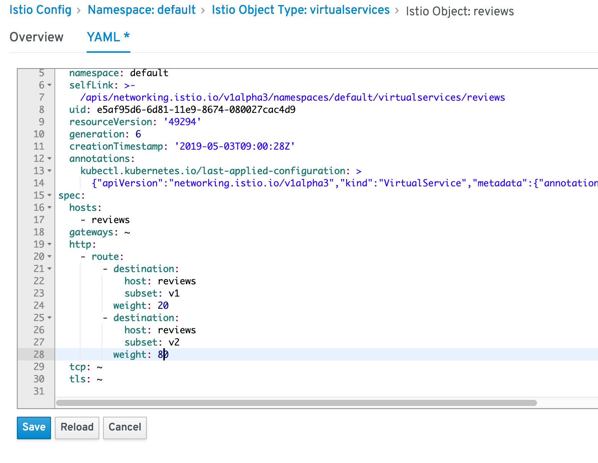
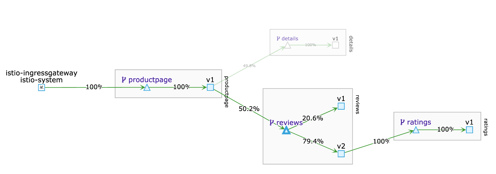

----

# ISTIO Introduction

Microservices and containers changed application design and deployment patterns, but along with them brought challenges like service discovery, routing, failure handling, and visibility to microservices. "Service mesh" architecture was born to handle these features. Applications are getting decoupled internally as microservices, and the responsibility of maintaining coupling between these microservices is passed to the service mesh.

[Istio](https://istio.io/), a joint collaboration between IBM, Google and Lyft provides an easy way to create a service mesh that will manage many of these complex tasks automatically, without the need to modify the microservices themselves. Istio does this by:

1. Deploying a **control plane** that manages the overall network infrastructure and enforces the policy and traffic rules defined by the devops team

2. Deploying a **data plane** which includes “sidecars”, secondary containers that sit along side of each instance of a microservice and act as a proxy to intercept all incoming and outgoing network traffic. Sidecars are implemented using Envoy, an open source edge proxy

Once Istio is installed some of the key feature which it makes available include

- Traffic management using **Istio Pilot**: In addition to providing content and policy based load balancing and routing, Pilot also maintains a canonical representation of services in the mesh.

- Access control using **Istio Auth**: Istio Auth secures the service-to-service communication and also provides a key management system to manage keys and certificates.

- Monitoring, reporting and quota management using **Istio Mixer**: Istio Mixer provides in depth monitoring and logs data collection for microservices, as well as collection of request traces. Precondition checking like whether the service consumer is on whitelist, quota management like rate limits etc. are also configured using Mixer.

In the first part of this journey we show how we can deploy the sample [BookInfo](https://istio.io/docs/samples/bookinfo.html) application and inject sidecars to get the Istio features mentioned above, and walk through the key ones. The BookInfo is a simple application that is composed of four microservices, written in different languages for each of its microservices namely Python, Java, Ruby, and Node.js. The application does not use a database, and stores everything in local filesystem.

Also since Istio tightly controls traffic routing to provide above mentioned benefits, it introduces some drawbacks. Outgoing traffic to external services outside the Istio data plane can only be enabled by specialized configuration, based on the protocol used to connect to the external service.

In the [second part](#part-b-modify-sample-application-to-use-an-external-datasource-deploy-the-application-and-istio-envoys-with-egress-traffic-enabled) of the journey we focus on how Istio can be configured to allow applications to connect to external services. For that we modify the sample BookInfo application to use an external database and then use it as a base to show Istio configuration for enabling egress traffic.


## Included Components
- [Istio](https://istio.io/)
- [Kiali](https://www.kiali.io/)
- [Grafana](http://docs.grafana.org/guides/getting_started)
- [Jaeger](https://www.jaegertracing.io/)
- [Prometheus](https://prometheus.io/)


---


### Objectives

After you complete this course, you'll be able to: - Download and install Istio in your cluster - Deploy the Bookinfo sample app - Use metrics, logging and tracing to observe services - Set up the Istio Ingress Gateway - Perform simple traffic management, such as A/B tests and canary deployments 


### Workshop

* Lab 1 - Minkube
* Lab 2 - Installing Istio
* Lab 3 - Deploy the Bookinfo App
* Lab 4 - Monitoring with Kiali
* Lab 5 - Traffic flow management
* Lab 6 - Access policy enforcement
* Lab 7 - Telemetry data aggregation


---
# Minikube


## Make sure minikube is running 


* Verify that minikube is running
	If not please complete KUB01 Lab Setup


	```
	$ minikube status
	
	host: Running
	kubelet: Running
	apiserver: Running
	kubectl: Correctly Configured: pointing to minikube-vm at 192.168.99.100
	```
	
* Verify kubectl can communicate with your cluster.

	```
	$ kubectl get nodes
	
	NAME       STATUS    ROLES     AGE       VERSION
	minikube   Ready     master    32m       v1.14.1
	```


## Enable Kubernetes Dashboard

```
$ minikube dashboard                                                                                              

🔌  Enabling dashboard ...
🤔  Verifying dashboard health ...
🚀  Launching proxy ...
🤔  Verifying proxy health ...
🎉  Opening http://127.0.0.1:58935/api/v1/namespaces/kube-system/services/http:kubernetes-dashboard:/proxy/ in your default browser...
```


After a while the Kubernetes Dashboard will open

	
	
## Getting to know minikube

### What is Minikube?

Minikube is an open source tool that enables you to run Kubernetes on your laptop or other local machine. It can work with Linux, Mac, and Windows operating systems. It runs a single-node cluster inside a virtual machine on your local machine.


minikube runs the official stable release of Kubernetes, with support for standard Kubernetes features like:

* LoadBalancer - using `minikube tunnel`
* Multi-cluster - using `minikube start -p <name>`
* NodePorts - using `minikube service`
* Persistent Volumes
* Ingress
* RBAC
* Dashboard - `minikube dashboard`
* Container runtimes
* Configure apiserver and kubelet options via command-line flags
* Addons - a marketplace for developers to share configurations for running services on minikube

## Useful commands

Start a cluster by running:

`minikube start`

Access Kubernetes Dashboard within Minikube:

`minikube dashboard`

Open this exposed endpoint in your browser:

`minikube service hello-minikube`

Start a second local cluster:

`minikube start -p cluster2`

Stop your local cluster:

`minikube stop`

Delete your local cluster:

`minikube delete`

----

# Lab 2 - Installing Istio 
In this module, you download and install Istio.

1.  Either download Istio directly from [https://github.com/niklaushirt/istio.gits](https://github.com/niklaushirt/istio.git) or get the latest version by using curl:

    ```
    $ git clone https://github.com/niklaushirt/istio.git
    ```

2. Change the directory to the Istio file location.

    ```
    $ cd istio
    ```

3. Add the `istioctl` client to your PATH. 

    ```
    $ export PATH=$PWD/bin:$PATH
    ```

4. Install Istio’s Custom Resource Definitions via kubectl apply, and wait a few seconds for the CRDs to be committed in the kube-apiserver:

    ```
    $ for i in install/kubernetes/helm/istio-init/files/crd*yaml; do kubectl apply -f $i; done
    ```

5. Now let's install Istio demo profile into the `istio-system` namespace in your Kubernetes cluster:

    ```
    $ kubectl apply -f install/kubernetes/istio-demo.yaml
    ```


6. Label the default namespace for automatic sidecar injection

	```
	$ kubectl label namespace default istio-injection=enabled                                                                                   
	
	namespace/default labeled
	
	$ kubectl get ns --show-labels                                                                                                              
	
	$NAME              STATUS   AGE   LABELS
	default           Active   30m   istio-injection=enabled
	istio-system      Active   15m   istio-injection=disabled
	kube-node-lease   Active   30m   <none>
	kube-public       Active   30m   <none>
	kube-system       Active   30m   <none>
	```


6. Ensure that the `istio-*` Kubernetes services are deployed before you continue.

    ```
    $ kubectl get svc -n istio-system
    ```
    
    Sample output:
    
    ```
NAME                     TYPE           CLUSTER-IP      EXTERNAL-IP   PORT(S)                                                                                                                                      AGE
grafana                  NodePort       10.100.39.1     <none>        3000:31551/TCP                                                                                                                               14h
istio-citadel            ClusterIP      10.97.131.248   <none>        8060/TCP,15014/TCP                                                                                                                           14h
istio-egressgateway      ClusterIP      10.97.129.60    <none>        80/TCP,443/TCP,15443/TCP                                                                                                                     14h
istio-galley             ClusterIP      10.109.79.240   <none>        443/TCP,15014/TCP,9901/TCP                                                                                                                   14h
istio-ingressgateway     LoadBalancer   10.110.220.29   <pending>     15020:31197/TCP,80:31380/TCP,443:31390/TCP,31400:31400/TCP,15029:32154/TCP,15030:32753/TCP,15031:30805/TCP,15032:31588/TCP,15443:30142/TCP   14h
istio-pilot              ClusterIP      10.108.237.62   <none>        15010/TCP,15011/TCP,8080/TCP,15014/TCP                                                                                                       14h
istio-policy             ClusterIP      10.111.7.15     <none>        9091/TCP,15004/TCP,15014/TCP                                                                                                                 14h
istio-sidecar-injector   ClusterIP      10.106.49.81    <none>        443/TCP                                                                                                                                      14h
istio-telemetry          ClusterIP      10.98.0.68      <none>        9091/TCP,15004/TCP,15014/TCP,42422/TCP                                                                                                       14h
jaeger-agent             ClusterIP      None            <none>        5775/UDP,6831/UDP,6832/UDP                                                                                                                   14h
jaeger-collector         ClusterIP      10.105.150.31   <none>        14267/TCP,14268/TCP                                                                                                                          14h
jaeger-query             ClusterIP      10.108.240.60   <none>        16686/TCP                                                                                                                                    14h
kiali                    NodePort       10.99.99.251    <none>        20001:31552/TCP                                                                                                                              14h
prometheus               ClusterIP      10.104.5.70     <none>        9090/TCP                                                                                                                                     14h
tracing                  ClusterIP      10.103.33.199   <none>        80/TCP                                                                                                                                       14h
zipkin                   ClusterIP      10.110.75.25    <none>        9411/TCP
    ```


1. Ensure the corresponding pods are all in **`Running`** state before you continue.

    ```
    $ kubectl get pods -n istio-system
    ```
    Sample output:
    
    ```
    NAME                                      READY   STATUS      RESTARTS   AGE
    grafana-5c45779547-v77cl                  1/1     Running     0          103s
    istio-citadel-79cb95445b-29wvj            1/1     Running     0          102s
    istio-cleanup-secrets-1.1.0-mp6qq         0/1     Completed   0          112s
    istio-egressgateway-6dfb8dd765-jzzxf      1/1     Running     0          104s
    istio-galley-7bccb97448-tk8bz             1/1     Running     0          104s
    istio-grafana-post-install-1.1.0-bvng6    0/1     Completed   0          113s
    istio-ingressgateway-679bd59c6-5bsbr      1/1     Running     0          104s
    istio-pilot-674d4b8469-ttxs8              2/2     Running     0          103s
    istio-policy-6b8795b6b5-g5m2k             2/2     Running     2          103s
    istio-security-post-install-1.1.0-cfqpx   0/1     Completed   0          111s
    istio-sidecar-injector-646d77f96c-55twm   1/1     Running     0          102s
    istio-telemetry-76c8fbc99f-hxskk          2/2     Running     2          103s
    istio-tracing-5fbc94c494-5nkjd            1/1     Running     0          102s
    kiali-56d95cf466-bpgfq                    1/1     Running     0          103s
    prometheus-8647cf4bc7-qnp6x               1/1     Running     0          102s
    ```


	
Before you continue, make sure all the pods are deployed and are either in the **`Running`** or **`Completed`** state. If they're in `Pending` or `CrashLoopBackOff` state, wait a few minutes to let the deployment to settle.

Congratulations! You successfully installed Istio into your cluster.


# Lab 3 - Deploy sample BookInfo application with Istio sidecar injected

In this part, we will be using the sample BookInfo Application that comes as default with Istio code base. As mentioned above, the application that is composed of four microservices, written in different languages for each of its microservices namely Python, Java, Ruby, and Node.js. The default application doesn't use a database and all the microservices store their data in the local file system.


Envoys are deployed as sidecars on each microservice. Injecting Envoy into your microservice means that the Envoy sidecar would manage the ingoing and outgoing calls for the service. To inject an Envoy sidecar to an existing microservice configuration, do:

```
$ kubectl apply -f ./samples/bookinfo/platform/kube/bookinfo.yaml
```


After a few minutes, you should now have your Kubernetes Pods running and have an Envoy sidecar in each of them alongside the microservice. The microservices are **productpage, details, ratings, and reviews**. Note that you'll have three versions of the reviews microservice.


```
$ kubectl get pods


NAME                                        READY     STATUS    RESTARTS   AGE
details-v1-1520924117-48z17                 2/2       Running   0          6m
productpage-v1-560495357-jk1lz              2/2       Running   0          6m
ratings-v1-734492171-rnr5l                  2/2       Running   0          6m
reviews-v1-874083890-f0qf0                  2/2       Running   0          6m
reviews-v2-1343845940-b34q5                 2/2       Running   0          6m
reviews-v3-1813607990-8ch52                 2/2       Running   0          6m
```

### Expose the Application via Ingress Gateway

The components deployed on the service mesh by default are not exposed outside the cluster. External access to individual services so far has been provided by creating an external load balancer or node port on each service.

An Ingress Gateway resource can be created to allow external requests through the Istio Ingress Gateway to the backing services.

Create an Istio ingress gateway to access your services over a public IP address.

```
$ kubectl apply -f  ./samples/bookinfo/networking/bookinfo-gateway.yaml
```


Now you can access your application via: [`http://192.168.99.100:31380/productpage`](http://192.168.99.100:31380/productpage) (replace 192.168.99.100 with the address of your cluster)

If you refresh the page multiple times, you'll see that the _reviews_ section of the page changes. That's because there are 3 versions of **reviews**_(reviews-v1, reviews-v2, reviews-v3)_ deployment for our **reviews** service. Istio’s load-balancer is using a round-robin algorithm to iterate through the 3 instances of this service

##### V1 - No ratings


##### V2 - Ratings with black stars


##### V3- Ratings with red stars


## Sidecar injection

In Kubernetes, a sidecar is a utility container in the pod, and its purpose is to support the main container. For Istio to work, Envoy proxies must be deployed as sidecars to each pod of the deployment. There are two ways of injecting the Istio sidecar into a pod: manually using the istioctl CLI tool or automatically using the Istio Initializer. In this exercise, we will use the manual injection. Manual injection modifies the controller configuration, e.g. deployment. It does this by modifying the pod template spec such that all pods for that deployment are created with the injected sidecar.


# Lab 4 - Monitoring with Kiali

[Kiali](https://www.kiali.io/) is an open-source project that installs on top of Istio to visualize your service mesh. It provides deeper insight into how your microservices interact with one another, and provides features such as circuit breakers and request rates for your services


**In order to create some more sustained traffic, open a new tab in the Terminal and paste the following code**

```
$ for i in `seq 1 200000`; do curl http://192.168.99.100:31380/productpage; done
```

**Note**

```
If you get this:

	for i in `seq 1 200000`; do curl http://192.168.99.100:31380/productpage\; done
	for>

Just delete the backslash (\) after productpage.
```

You can open Kiali via [`http://192.168.99.100:31552/kiali/`](http://192.168.99.100:31552/kiali/) (replace 192.168.99.100 with the address of your cluster)

Login is:

	User: admin
	Password: admin


1. Select `Graph` in the left hand menu.
1. Then select `default` from the Namespaces drop-down menu
1. Make sure that you check all types from the `Display` drop-down menu
1. And `Requests percent of total` from the `Edge Labels` drop-down menu
2. If you see no objects, there might be no traffic flowing through your mesh network yet (you chan change the seeting to display inactive objects too)
3. You might want to change the refresh rate to 10s to more easily observe the changes in traffic

You can then observe traffic flowing through your mesh network.


Get more info on the [Kiali](https://www.kiali.io/documentation/overview/) website.

[Visualizing Your Mesh](https://istio.io/docs/tasks/telemetry/kiali/)


# Lab 5 - Traffic flow management using Istio Pilot

## Using rules to manage traffic
The core component used for traffic management in Istio is Pilot, which manages and configures all the Envoy proxy instances deployed in a particular Istio service mesh. It lets you specify what rules you want to use to route traffic between Envoy proxies, which run as sidecars to each service in the mesh. Each service consists of any number of instances running on pods, containers, VMs etc. Each service can have any number of versions (a.k.a. subsets). There can be distinct subsets of service instances running different variants of the app binary. These variants are not necessarily different API versions. They could be iterative changes to the same service, deployed in different environments (prod, staging, dev, etc.). Pilot translates high-level rules into low-level configurations and distributes this config to Envoy instances. Pilot uses three types of configuration resources to manage traffic within its service mesh: Virtual Services, Destination Rules, and Service Entries.

### Virtual Services
A [VirtualService](https://istio.io/docs/reference/config/istio.networking.v1alpha3/#VirtualService) defines a set of traffic routing rules to apply when a host is addressed. Each routing rule defines matching criteria for traffic of a specific protocol. If the traffic is matched, then it is sent to a named [destination](https://istio.io/docs/reference/config/istio.networking.v1alpha3.html#Destination) service (or [subset](https://istio.io/docs/reference/config/istio.networking.v1alpha3/#Subset) or version of it) defined in the service registry.

### Destination Rules
A [DestinationRule](https://istio.io/docs/reference/config/istio.networking.v1alpha3/#Destination) defines policies that apply to traffic intended for a service after routing has occurred. These rules specify configuration for load balancing, connection pool size from the sidecar, and outlier detection settings to detect and evict unhealthy hosts from the load balancing pool. Any destination `host` and `subset` referenced in a `VirtualService` rule must be defined in a corresponding `DestinationRule`.

### Service Entries
A [ServiceEntry](https://istio.io/docs/reference/config/istio.networking.v1alpha3.html#ServiceEntry) configuration enables services within the mesh to access a service not necessarily managed by Istio. The rule describes the endpoints, ports and protocols of a white-listed set of mesh-external domains and IP blocks that services in the mesh are allowed to access.

---

## The Bookinfo Application

In this section, Istio will be configured to dynamically modify the network traffic between some of the components of our application. In this case we have 2 versions of the “reviews” component (v1 and v2) but we don’t want to replace review-v1 with review-v2 immediately. In most cases, when components are upgraded it’s useful to deploy the new version but only have a small subset of network traffic routed to it so that it can be tested before the old version is removed. This is often referred to as “canary testing”.


There are multiple ways in which we can control this routing. It can be based on which user or type of device that is accessing it, or a certain percentage of the traffic can be configured to flow to one version.

This step shows you how to configure where you want your service requests to go based on weights and HTTP Headers. You would need to be in the root directory of the Istio release you have downloaded on the Prerequisites section.

---

## Set default Destination Rules

Before moving on, we have to define the destination rules. The destination rules tell Istio what versions (subsets in Istio terminology) are available for routing. This step is required before fine-grained traffic shaping is possible.

```
$ kubectl apply -f ./samples/bookinfo/networking/destination-rule-all.yaml


destinationrule.networking.istio.io/productpage created
destinationrule.networking.istio.io/reviews created
destinationrule.networking.istio.io/ratings created
destinationrule.networking.istio.io/details created
```

For more details, see the [Istio documentation](https://istio.io/docs/tasks/traffic-management/traffic-shifting/).

---

## A/B testing with Istio
A/B testing is a method of performing identical tests against two separate service versions in order to determine which performs better. 

Set Default Routes to `reviews-v1` for all microservices  

This would set all incoming routes on the services (indicated in the line `destination: <service>`) to the deployment with a tag `version: v1`. To set the default routes, run:

  ```
  $ kubectl apply -f ./samples/bookinfo/networking/virtual-service-all-v1.yaml
  ```

Observe in the Kiali Dashboard. After a short wile you should see that all traffic is going to V1.


**After a theoretical deployment of v2:**

Route 100% of the traffic to the `version: v2` of the **reviews microservices**  

This will direct/switch all incoming traffic to version v2 of the reviews microservice. Run:

  ```
  $ kubectl apply -f ./samples/bookinfo/networking/virtual-service-reviews-v2.yaml
  ```
  
Observe in the [Kiali Dashboard](http://192.168.99.100:31552/kiali/). After a short wile you should see that all traffic is going to V2.


---

  
## Canary deployment
In `Canary Deployments`, newer versions of services are incrementally rolled out to users to minimize the risk and impact of any bugs introduced by the newer version. To begin incrementally routing traffic to the newer version of the guestbook service, modify the original `VirtualService` rule.


Route 80% of traffic on **reviews microservice** to `reviews-v1` and 20% to `reviews-v2`.  

This is indicated by the `weight: 80 and 20` in the yaml file.

  > Using `replace` should allow you to edit existing route-rules.

  ```
  $ kubectl apply -f ./samples/bookinfo/networking/virtual-service-reviews-80-20.yaml
  ```

Observe in the [Kiali Dashboard](http://192.168.99.100:31552/kiali/). After a short wile you should see that about 80% of the traffic is going to V1 and 80% of the traffic is going to V2.



---


## Navigating Kiali
Open [Kiali Dashboard](http://192.168.99.100:31552/kiali/) and select the `reviews` service in the graph.


To the right you can observe specific metrics for this service.
Then open the `reviews` service overview:


In this view you can get details about the service, like averall Health, assigned `Workloads` and much more.



**Feel free to browse some more to get familiar with the interface.**

Now open the `reviews` service details by selecting the `Virtual Services` tab and selecting `reviews`.


Here you get more detailed information about the service, like the weight distribution:


---

## Gradual Rollout

In order to gradually roll out a new release we have to change the weight distribution.

* Click on the `YAML` tab
* Modify the weight to 20%/80% 
* Click `Save`



Observe in the [Kiali Dashboard](http://192.168.99.100:31552/kiali/). After a short wile you should see that about 20% of the traffic is going to V1 and 90% of the traffic is going to V2.



**Note:** The sum of the weights must be equal to 100%

---


## Traffic Steering / Dark Launch
Define certain conditions (Username, type of phone, ...) that will be using the new service.

Set Route to `reviews-v2` of **reviews microservice** for a specific user  

This would set the route for the user `jason` (You can login as _jason_ with any password in your deploy web application) to see the `version: v3` of the reviews microservice. 


Run:

  ```
  $ kubectl apply -f ./samples/bookinfo/networking/virtual-service-reviews-jason-v2v3
  ```
  
 Go to the Bookinfo Application: [`http://192.168.99.100:31380/productpage`](http://192.168.99.100:31380/productpage) (replace 192.168.99.100 with the address of your cluster).
 
**Refresh several times** - You should see only black stars, meaning that you are using V2. 
 


Now login to the Web Application as user jason with password jason and **refresh several times**. You should see only red stars, meaning that you are using V3.

Observe in the [Kiali Dashboard](http://192.168.99.100:31552/kiali/). After a short wile you should see that a small percentage of traffic is going to V3, which corresponds to your page refreshes.


----
  

# Lab 6 - Access policy enforcement

This step shows you how to control access to your services. It helps to reset the routing rules to ensure that we are starting with a known configuration. The following commands will first set all review requests to v1, and then apply a rule to route requests from user _jason_ to v2, while all others go to v3:

```
   $ kubectl apply -f ./samples/bookinfo/networking/virtual-service-all-v1.yaml
   $ kubectl apply -f ./samples/bookinfo/networking/virtual-service-reviews-jason-v2-v3.yaml
```

Go to the Bookinfo Application: [`http://192.168.99.100:31380/productpage`](http://192.168.99.100:31380/productpage) (replace 192.168.99.100 with the address of your cluster).

You'll now see that your `productpage` always shows red stars on the reviews section if not logged in, and always shows black stars when logged in as _jason_.

* To deny access to the ratings service for all traffic coming from `reviews-v3`, you will use apply these rules:

  ```
   $ kubectl apply -f ./samples/bookinfo/policy/mixer-rule-deny-label.yaml
   $ kubectl apply -f ./samples/bookinfo/policy/mixer-rule-ratings-denial.yaml
  ```

* To verify if your rule has been enforced, point your browser to your BookInfo Application. You'll notice you see no stars (Ratings service is currently unavailable) from the reviews section unless you are logged in as _jason_, in which case you'll see black stars.


And in Kiali you should see the following:


## Cleanup 

Now let's clean up the mess and get back to a nice simple state.

```
$ kubectl delete -f ./samples/bookinfo/policy/mixer-rule-deny-label.yaml
kubectl delete -f ./samples/bookinfo/policy/mixer-rule-ratings-denial.yaml
kubectl delete -f ./samples/bookinfo/networking/virtual-service-all-v1.yaml
kubectl delete -f ./samples/bookinfo/networking/virtual-service-reviews-jason-v2-v3.yaml
kubectl apply -f ./samples/bookinfo/networking/destination-rule-all.yaml
```

---  


# Lab 7 - Telemetry data aggregation - metrics, logs and trace spans

### Challenges with microservices

We all know that microservice architecture is the perfect fit for cloud native applications and it increases the delivery velocities greatly. Envision you have many microservices that are delivered by multiple teams, how do you observe the the overall platform and each of the service to find out exactly what is going on with each of the services?  When something goes wrong, how do you know which service or which communication among the few services are causing the problem?

### Istio telemetry

Istio's tracing and metrics features are designed to provide broad and granular insight into the health of all services. Istio's role as a service mesh makes it the ideal data source for observability information, particularly in a microservices environment. As requests pass through multiple services, identifying performance bottlenecks becomes increasingly difficult using traditional debugging techniques. Distributed tracing provides a holistic view of requests transiting through multiple services, allowing for immediate identification of latency issues. With Istio, distributed tracing comes by default. This will expose latency, retry, and failure information for each hop in a request.

You can read more about how [Istio mixer enables telemetry reporting](https://istio.io/docs/concepts/policy-and-control/mixer.html).


### Collect metrics and logs using Prometheus and Grafana

This step shows you how to configure [Istio Mixer](https://istio.io/docs/concepts/policy-and-control/mixer.html) to gather telemetry for services in your cluster.


* Make sure you still send traffic to that service. You can renew the `for` loop from earlier.

	```
	$ for i in `seq 1 200000`; do curl http://192.168.99.100:31380/productpage; done
	```

* Point your browser to [`http://192.168.99.100:31551/`](http://192.168.99.100:31551) (replace 192.168.99.100 with the address of your cluster)
* Click on the `Home` button in the upper left hand corner
* Select `Istio Service Dashboard`


  Your dashboard should look like this:  
  
 
Play around and observe the different metrics being collected.

[Collecting Metrics on Istio](https://istio.io/docs/tasks/telemetry/metrics/)

[Collecting Logs on Istio](https://istio.io/docs/tasks/telemetry/logs/)

### Collect request traces using Jaeger

Jaeger is a distributed tracing tool that is available with Istio.

  * Access the Jaeger dashboard at [`http://192.168.99.100:31553/`](http://192.168.99.100:31553) (replace 192.168.99.100 with the address of your cluster)
  * Select `productpage.default` in the left hand `Service` dropdown
  * Click `Find Traces`

  Your dashboard should look something like this:
  
  

* Make sure you still send traffic to that service. You can renew the `for` loop from earlier.

	```
	$ for i in `seq 1 200000`; do curl http://192.168.99.100:31380/productpage; done
	```

* Click on one of those traces and you will see the details of the traffic you sent to your BookInfo App. It shows how much time it took for the request on `productpage` to finish. It also shows how much time it took for the requests on the `details`,`reviews`, and `ratings` services.


[Jaeger Tracing on Istio](https://istio.io/docs/tasks/telemetry/distributed-tracing/)


# Clean-up


* To delete the BookInfo app and its route-rules: ` ./samples/bookinfo/platform/kube/cleanup.sh`

* To delete Istio from your cluster

```
$  kubectl delete -f ./samples/bookinfo/platform/kube/bookinfo.yaml
kubectl delete -f  ./samples/bookinfo/networking/bookinfo-gateway.yaml
kubectl delete -f https://raw.githubusercontent.com/niklaushirt/microservices-traffic-management-using-istio/master/istio.yaml
kubectl delete -f ~/istio/install/kubernetes/helm/istio/templates/crds.yaml
kubectl delete ns istio-system

```


